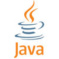

# Raptor Code Conventions

What are Coding Conventions?  Well, one of the first rules you learn in the real world is  1) Don't Reinvent the Wheel.  So I'll let some better authors then I explain it better, [click here](https://en.wikipedia.org/wiki/Coding_conventions#:~:text=Coding%20conventions%20are%20a%20set,program%20written%20in%20that%20language.).

## Java

@gabrielseaver9678  put your conventions/recommendations here

### Comment your code

## Markdown / Documentation

1) Use the GitHub Markdown style.  Their MD [guidelines can be found here](https://docs.github.com/en/get-started/writing-on-github/getting-started-with-writing-and-formatting-on-github/basic-writing-and-formatting-syntax).
2) Everyone gets a README.md file..  

## Git / GitHub

1) Create a personal account on GitHub and ask a programming mentor to add your account to the Raptor1711 organization.  [Click here to create a GitHub](https://github.com/join) account, if you don't already have one.
2) Read the docs about [getting started with Git and GitHub](https://docs.github.com/en/get-started).
3) The main branch is protected. Only a 1711 organization admin can approve Pull Requests to the main branch. Create a your own branch of the main branch, and when your changes are complete and tested, submit a Pull Request to have your code added to the main branch.
4) Git and GitHub terms and processes to know

    - Commits
    - Branches
    - Merging / Pull Requests
    - Stashing (WIP)

## VS Code

1) Setting up WPI / Java / VS Code using the FRC WPI Installer.
2) Common VS Code extensions you will over the stand Java, WPI extensions.
    - java linter
    - markdown linter
